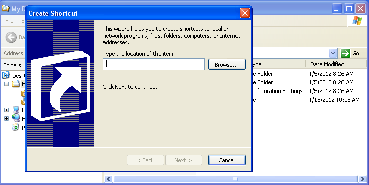
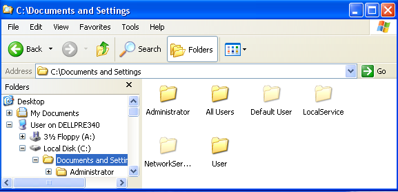
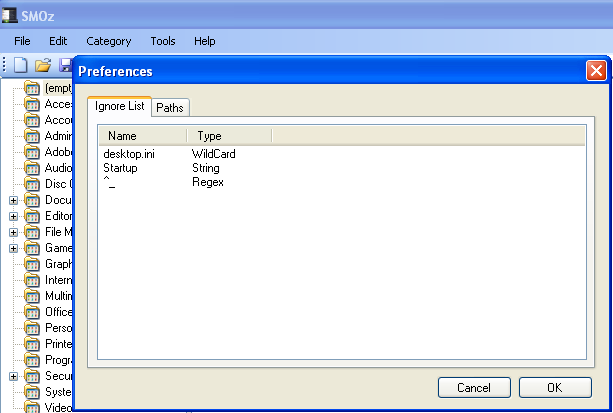
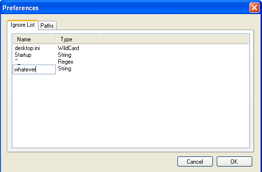
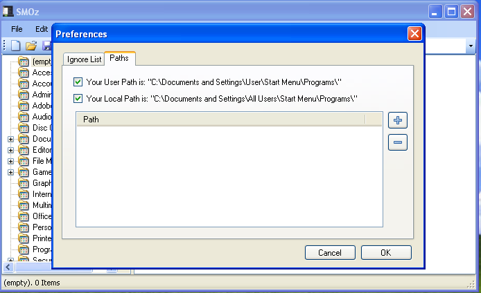
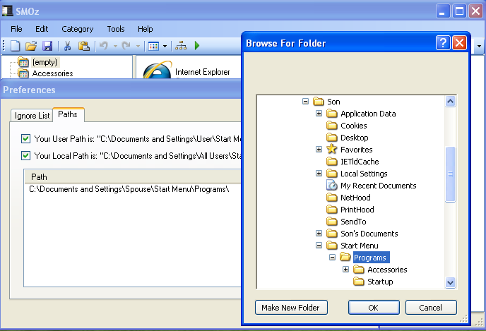
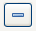

*******************************
Configuring Your Design in SMOz
*******************************

Shortcuts
=========

Of course, SMOz doesn't actually move programs around. It just moves *pointers* to programs or, as Windows calls them,
*Shortcuts*. A shortcut has a special *.lnk* or *.url* extension but is otherwise just another file. Explorer shows the
file name but hides the extension even if you have configured Explorer to show file extensions. You can see them, though,
by opening a command prompt and doing a 'dir' of any directory containing one. While the content is ASCII, you can only
read it with a special program or hex editor.

You can make a shortcut yourself quite easily. In Explorer, right-click the white space in the main window, click
*New* and :guilabel:`&Shortcut`. Then just follow the instructions.

|linefeed|

|linefeed|

|linefeed|

|linefeed|

|pagebreak|

There are also programs such as `XXMkLink.exe <http://www.xxcopy.com/xxcopy38.htm>`_ which let you create
shortcuts from a batch file. Shortcuts can be copied or moved freely anywhere you like, which
is the feature that allows one to (re)organize them.

Windows Profiles
================

Windows maintains for each user a 'Profile' containing the exclusive data for a personalized desktop environment.
There are several profiles and each is stored in a sub-folder of :menuselection:`C:\\Documents and Settings`
which is normally hidden but can be revealed easily. Click *Tools* on the Explorer toolbar, then *Folder Options*. Click
the *View* tab, scroll down to *Hidden Files and Folders* and check the *Show* option. Here are the profiles
of a typical Windows installation:

|linefeed|

|linefeed|

|linefeed|

|linefeed|

The shortcuts for each profile are found in :menuselection:`Profile-folder\\Start Menu\\Programs`. The Start
menu displays shortcuts merged from two profiles, *All Users* and that of the user currently logged on. The one exception
is *All Users\\Start Menu\\Programs\\Administrative Tasks* which is hidden by default. To display it, right-click
*Start*, then *Properties*. Click the *Customize* button, then the *Advanced* tab. Scroll down to *System Adminstrative
Tools* and check the appropriate display option.

|pagebreak|

SMOz Profiles
=============

.. index:: Preferences

SMOz also reads data from profiles but, unlike Windows, it can be configured both as to content and location using the
*Preferences* menu. Click :menuselection:`Edit --> Preferences` on the menu bar:

|linefeed|

|linefeed|

Ignore List
-----------

The first tab contains definitions of the shortcuts that should be ignored by SMOz when looking for shortcuts. The three
types of acceptable entries shown above behave as follows.

|linefeed|

|linefeed|

========  ==========================================================================================================
Type		Description
========  ==========================================================================================================
String		Looks for an exact pattern match. ( matches 'Startup' only )
WildCard	Looks for the pattern anywhere in the shortcut name. ( matches 'desktop.ini', new-desktop.ini', etc. )
Regex		Looks for a pattern matching the Regular Expression. ( matches any name starting with an underscore )
========  ==========================================================================================================

|linefeed|

|linefeed|

|pagebreak|

You can add or delete entries yourself. Right click on any entry or whitespace, then select *New* or *Delete*. Clicking
*New* will create a blank entry of type 'String'. Change the type if you wish but only to one of the above. Anything
else will produce an exception message and ask to 'Continue' or 'Quit'. Continuing will just default back to 'String'.
To enter the name, double click the white space to the left of the new type and key in the pattern. Click OK.

|linefeed|

|linefeed|

|linefeed|

|linefeed|

Note:

*	String and Wildcard patterns are case-insensitive. If case is required, use a Regex.
*	New entries will be saved on exit from SMOz and take effect on the next start.
*	'Ignore List' entries are stored in :menuselection:`Profile-folder\\Application Data\\SMOz\\IgnoreList.x.x.x.x.ini`

|pagebreak|

Paths
-----

The second tab contains definitions of the places SMOz should look for the shortcut names surviving the 'Ignore List'.

|linefeed|

By default, it looks in the same two profiles as Windows. Unchecking either of the defaults will cause it to be
ignored. Unchecking both will leave SMOz with nowhere to look and nothing to do. In a multi-user computer, adding
additional profiles will include their shortcuts. Click |image0| to the right of the window and browse to the
*Programs* folder of the appropriate profile. Click *OK* to include it. If you highlight a previously included
entry, clicking |image1| will delete it. For portable applications, you can create shortcuts to them in a dedicated
folder and include it as well.

'Path' changes cause the Start menu to be reloaded and take effect immediately. They are saved on exit
to :menuselection:`Profile-folder\\Application Data\\SMOz\\User.x.x.x.x.settings`

|pagebreak|

Categories
==========

Template Editing
================

.. todo:: Write Template Editing

