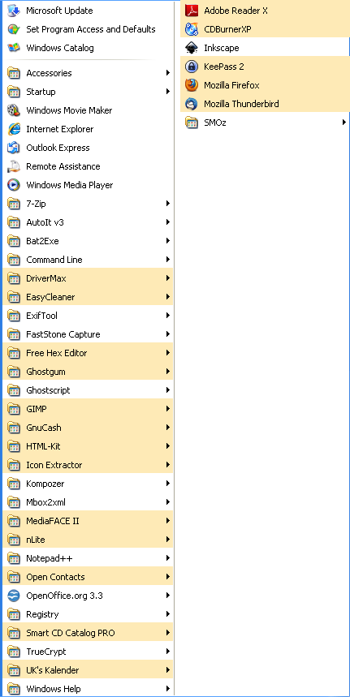
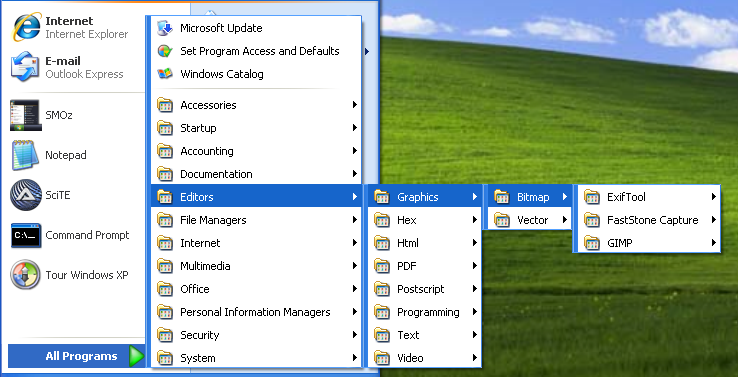
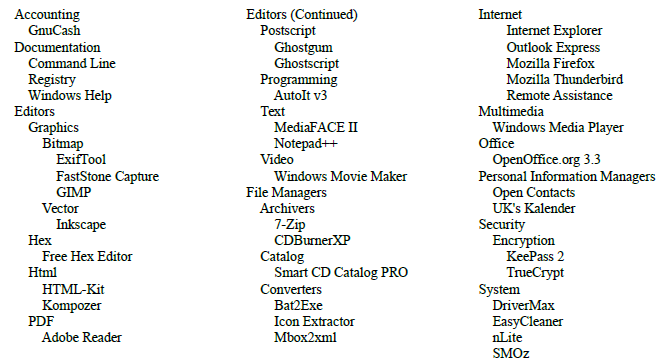

************************************
Designing Your Classification System
************************************

Suppose that clicking :menuselection:`Start --> All Programs` brings up a menu somewhat
longer than the trivial example shown in the preceding tutorial, - maybe something like this:

|pagebreak|

This menu only has around forty entries but still manages to hide things in plain sight. Its
alphabetic scheme is disrupted by multiple sequences making even the names hard to pick out.
And there is no way to narrow down the area to be searched, - which is the purpose of classification
and the subject to be considered here.

The Missing Element
===================

If you could start SMOz and try a test :menuselection:`Tools --> Apply Template/Continue`, you would see
that currently there are no rules for where most of these program links should go. But, more to the point, there are no
suitable destination categories for most of them to go *to*. Figuring out what additional categories may be needed
is not a trivial exercise and there is unlikely to be a single answer that is right for everybody. Given a
solution, configuring SMOz to implement it is simple enough. But, as the saying goes,
"*doing* it's easy; it's deciding what you *want* to do that's hard".

So somebody has to come up with a coherent set of classifications and here's the unvarnished truth:
SMOz helps those who help themselves.

Classification Resources
========================

For those who need a little help with software classifications, be reassured, - you're not alone. There are
even organizations which specialize in this subject. Here are a few:

*	The `North American Product Classification System <http://en.wikipedia.org/wiki/North_American_Product_Classification_System>`_
	has a  `Software Classification <http://www.swbusiness.fi/attachments/software_classification_structure.pdf>`_ list that
	is reasonably compact.

*	The `'Computers: Software' <http://www.dmoz.org/Computers/Software/>`_ directory is one of the topics covered by the
	`DMoz Open Directory Project <http://en.wikipedia.org/wiki/Open_Directory_Project>`_
	and is an exhausive, if not overwhelming, archive.

*	Wikipedia has an informative discussion of `Application Software <http://en.wikipedia.org/wiki/Application_software>`_
	along with some actual classifications.

*	Microsoft's :menuselection:`Start Menu --> All Programs --> Accessories` classification is arguably a good example of
	how *not* to do it.

Another approach is to look at how various download sites organize their offerings. Just Google terms like 'Software',
'Freeware' or 'Shareware'. Here are some examples:

*	`SnapFiles <http://www.snapfiles.com/freeware/>`_.

*	`CNET <http://download.cnet.com/windows/>`_.

*	`ZDNet <http://downloads.zdnet.com/>`_.

An Actual Example
=================

Ultimately, it's all a matter of opinion. Here is a :menuselection:`Start --> All Programs` menu showing how one user
reorganized the programs shown at the beginning of this chapter:

And here is the complete classification system used.

It's certainly not hard to imagine alternative arrangements. The trick is to put things where you believe you're
most likely to look. If it works for you, it's a good system. It doesn't have to be as elegant as the Periodic Table.

