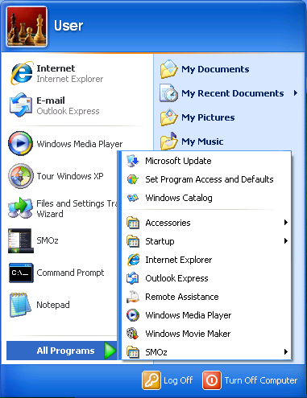
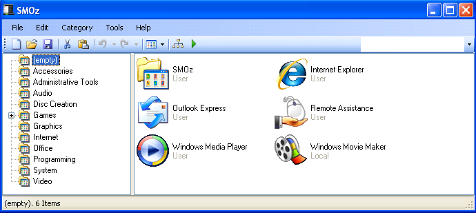
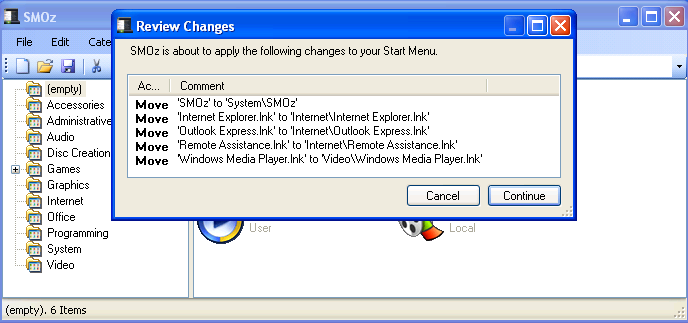
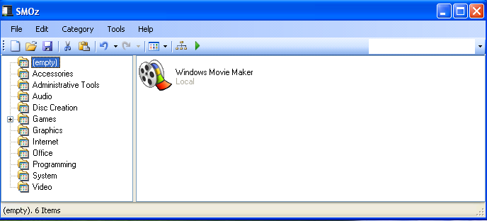
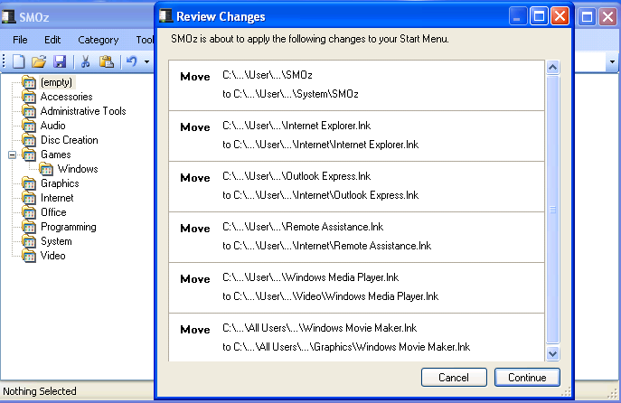
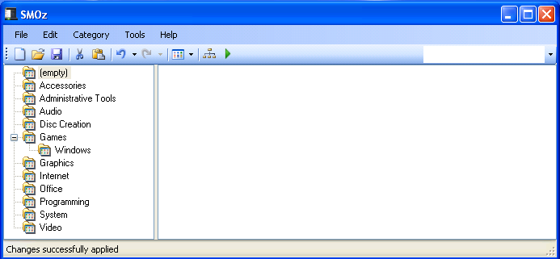
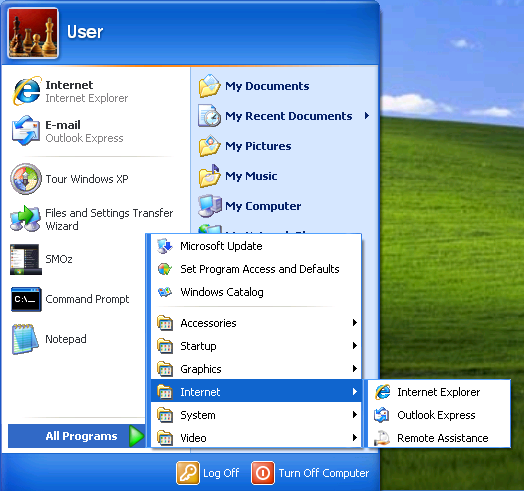

****************
A Quick Tutorial
****************

The primary input to SMOz is the contents of the :menuselection:`Start --> All Programs`
menu, a simple example of which might look like this:

|pagebreak|

And here is how SMOz interprets this input on its main screen:

Ignoring the :guilabel:`Startup` and :guilabel:`Accessories` folders by default, SMOz faithfully
shows each of the six other Start menu items in the right-hand pane of its window.
The left-hand pane shows the default categories into which it is possible to
organize the Start menu and distribute these entries.

Each of the categories also has a default list of the programs it is intended to contain.
To see how this set would be distributed, click |image0| on the Toolbar or :menuselection:`Tools --> Apply Template`
from the Menu bar. The following appears:

Notice that the change list is missing one item, - Windows Movie Maker. This indicates that,
although there may exist a suitable category, there is no *rule* for where Movie Maker ought to go.
Click on :guilabel:`Continue` to see the result of the proposed changes:

The Movie Maker icon remains to be moved because SMOz doesn't know where to move it. No problem.
Just click on the icon and drag it to one of the existing categories, - say Graphics. Now
click |image1| on the Toolbar or :menuselection:`Tools --> Apply Changes`. The following appears:

Now Movie Maker has been added to the queue of changes and will go to the Graphics category.
Click :guilabel:`Continue` and the main screen now looks like this:

Click :menuselection:`Start --> All Programs` to see how SMOz has changed it.

That's pretty much it. All the other things you can do in SMOz relate to configuring it to
handle the things you may want that it doesn't already know how to do. We'll get to all that
shortly.

.. |image0| image:: images/Toolbar/apply_template_button.png
				:height: 11pt
				:width: 11pt

.. |image1| image:: images/Toolbar/apply_changes_button.png
				:height: 11pt
				:width: 11pt
