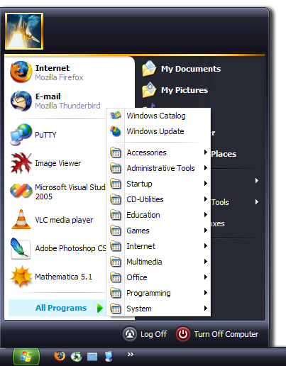

.. If you want to refer to commits at github, use: ":commit:`c285f31825`."
   If you want to refer to an article on wikipedia, use: ":wikipedia:`article`."

.. toctree::
   :hidden:
   :maxdepth: 1

   Home <self>
   reviews
   screenshots
   download
   documentation
   support
   code

SMOz
====

   A Start Menu after using SMOz.

SMOz (Start Menu Organizer) helps keep your Windows start menu organized.

SMOz provides an explorer-like view of the start menu where you can
simultaneously organize the start menu shortcuts that are spread
apart in multiple folders. You can quickly and easily drag and drop shortcuts
to categories of your choice. With unlimited undo-redo support, there is no risk.

SMOz also supports storing the categorization you have done to the start menu
as a template file, so you'll never have to repeat the work you've done.

With support for :wikipedia:`regular expression <Regular_expression>` rules in
the template, SMOz allows you to write complex templates. Advanced users can
thus quickly write powerful templates with little effort.

:doc:`Download Now<download>`

Features
--------

* An easy to use interface.
* Drag & Drop support.
* Displays system icons for all items.
* Built-in template editor.
* Unlimited Undo/Redo support.
* Atomically applies changes to the file system.
* Designed to be more easy to expand.

Development Activity
--------------------

.. If Javascript is enabled, the following container will be replaced with
   a list of most recent commits. See layout.html for more.

.. container:: github-commits

   You can view a list of the latest commits at `Sourceforge
   <http://smoz.git.sourceforge.net/git/gitweb.cgi?p=smoz/smoz;a=log>`_ or at
   `GitHub <https://github.com/nithinphilips/SMOz/commits>`_ .

