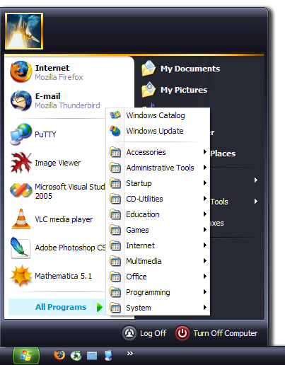
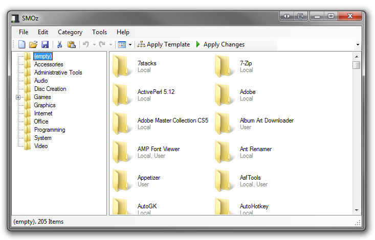
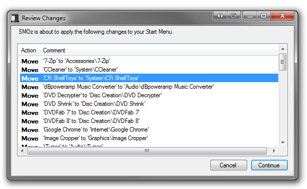
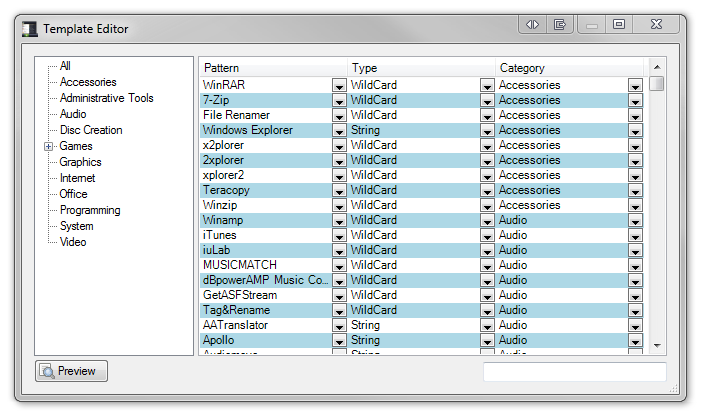
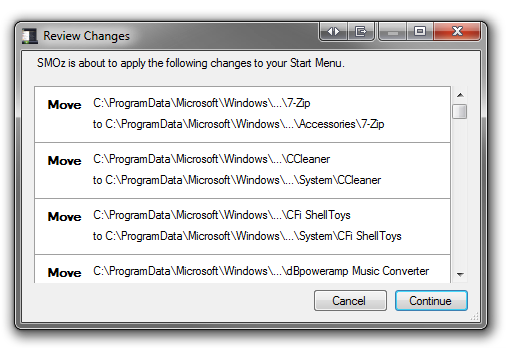
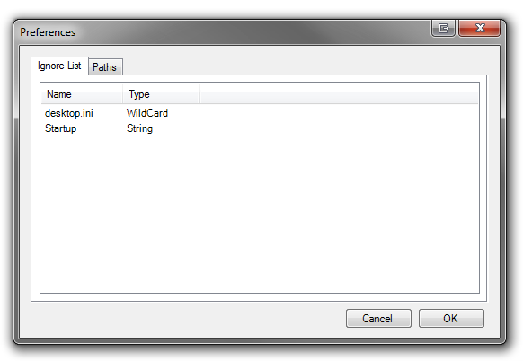
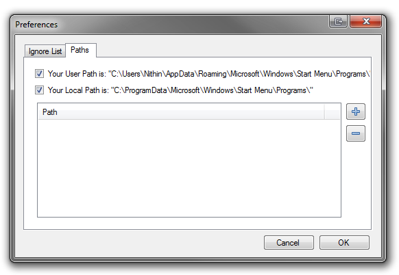

SMOz (Start Menu Organizer)
===========================

.. contents::
   :local:

   A Start Menu after using SMOz.

SMOz (Start Menu Organizer) is a program that can help you keep your Windows
start menu organized.

SMOz categorizes the items in the start menu according to a template file which
can be easily modified to fit your needs. A sample template file in included in
the release. A template file consists of categories and values (similar to ini
files). Files/Directories that match value, which can be simple text or a
regular expression, are moved to directories specified on categories. This
keeps your start menu clean with out the pain of manually organizing it every
time you re-install windows.

SMOz is tested to work on Windows XP with .NET framework v2.0.

.. container:: download_link

   `Download Links <#download>`_ at bottom.

Features
--------

Documentation
-------------
A user manual can be `viewed online`_ and a copy is included in the distribution.

You can also view the `latest draft copy`_ of the user manual.

.. _viewed online: doc/index.html
.. _latest draft copy: https://github.com/nithinphilips/SMOz/wiki

Getting Help
------------
If you need help there is a `mailing list`_ at
<smoz-users@lists.sourceforge.net>. You can `subscribe`_ to it or `browse`_
the archives. 

If you have found a bug, you can report it by sending an email to the `mailing list`_.

.. _subscribe:
.. _mailing list: https://lists.sourceforge.net/lists/listinfo/smoz-users
.. _browse: http://sourceforge.net/mailarchive/forum.php?forum_name=smoz-users

Screenshots
-----------

   The main window of SMOz

   Review Changes window before applying a template.

   The template editor.

   Review Changes window before applying changes to the start menu.

   Preferences: A list of files to always ignore.

   Preferences: A list of start menu folders.

What's New
----------
* SMOz was entirely rewritten.
* Current version has:

  * A much easier to use interface.
  * Drag & Drop support.
  * Displays icons for all items.
  * A template editor (not finished yet).
  * Unlimited Undo/Redo support (at least until memory is exhausted!)
  * Atomicity when applying changes to file system.
  * Targets version 2.0 of .NET Framework.
  * Designed to be more easy to expand.

.. _download_section:

Download
--------
The latest version is |release|.

Download: installer_, `zipped package`_ or `source code`_.

**Other Options:**

* See `all releases`_.
* Visit `project page`_ at sourceforge_.
* `Browse source code`_.

.. _installer: http://sourceforge.net/projects/smoz/files/smoz/0.7.1/SMOz-0.7.1-Setup.exe/download
.. _zipped package: http://sourceforge.net/projects/smoz/files/smoz/0.7.1/smoz-0.7.1-bin.zip/download
.. _source code: http://sourceforge.net/projects/smoz/files/smoz/0.7.1/smoz-0.7.1-src.zip/download

.. _all releases: http://sourceforge.net/projects/smoz/files/smoz/
.. _browse source code: http://smoz.git.sourceforge.net/
.. _project page: http://sourceforge.net/projects/smoz/
.. _sourceforge: http://www.sourceforge.net/

