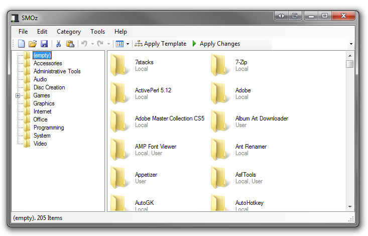
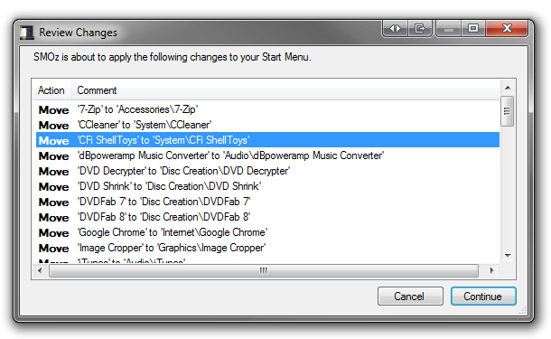
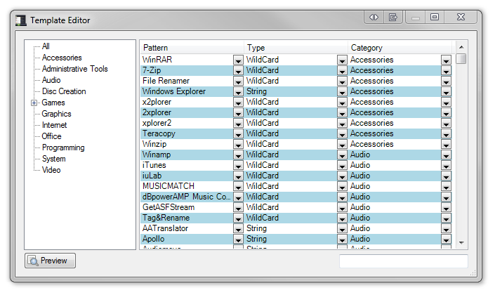
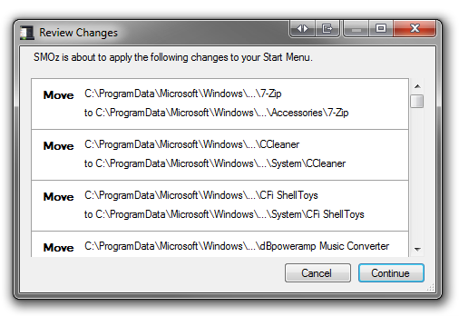
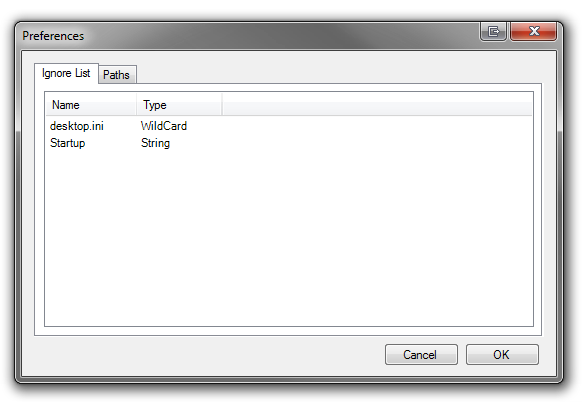
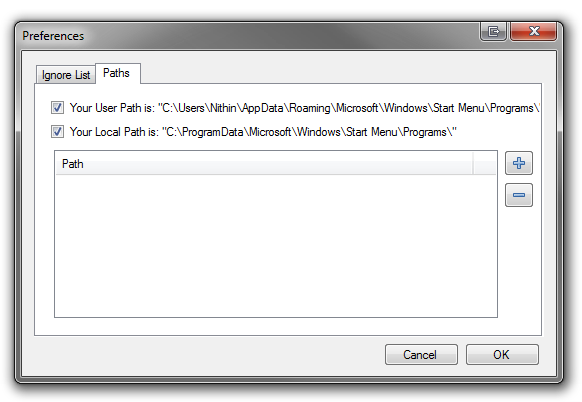

Screenshots
============

    The main window of SMOz. You can apply templates, preview changes and manually organize the Start Menu here.

    Review Changes window before applying a template.

    The template editor.

    Review Changes window before applying changes to the start menu.

    Preferences: A list of files to always ignore.

    Preferences: A list of start menu folders.
